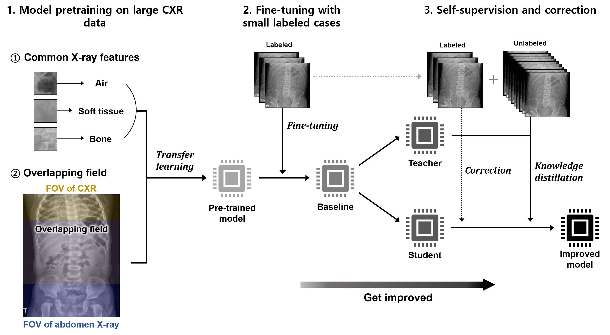

## Deep learning-enabled detection of pneumoperitoneum in supine and erect abdominal radiography: a retrospective study with external validations
### This is a code for application of DISTL (Distillation for self-supervised and self-train learning) along with the knowledge transfer for enhanced diagnosis of pneumoperitonuem.

<div align="center">
  
</div>

### [Paper] | [Official Pytorch code](https://github.com/sangjoon-park/AI-CAD-for-pneumoperitoneum)
More detailed explanations are provided in official github repository below.

https://github.com/sangjoon-park/AI-CAD-for-pneumoperitoneum

> **DISTL: Distillation for self-supervised and self-train learning**<br>
>
> *DISTL is a deep learning algorithm developed to gradually improve the performance of AI model with the accumulating data every year without any annotation by experts. This is a code for application of DISTL for along with the knowledge transfer for pneumoperitonuem diagnosis. For more details of the DISTL method, please refer to our previous work (https://github.com/sangjoon-park/AI-Can-Self-Evolve).*

## System requirements
### General requirements
#### OS
* Ubuntu 20.04

#### Software
* Python 3.8 (tested on)
* Conda
* Pytorch 1.8.0 (tested on)
* CUDA version 11.1 (tested on)

#### Hardware
* CPU or GPU that supports CUDA CuDNN and Pytorch 1.8.
* We tested on GeFore RTX 3090.
* We recommend RAM of more than 32 GB.

## Installation guide
### Instruction
* Install Pytorch and other dependencies. It can be easily installed with requirements.txt file.
```
>  pip install -r requirements.txt
```

## Data
Our work consists of two steps. 
1. pre-training on a large corpus of chest radiograph (CheXpert) for knowledge transfer.
2. fine-tune model on abdominal radiograph dataset with DISTL method.

### 1. Pre-training data (Chest radiograph)

The CheXpert data is an open-sourced large corpus of chest radiographs containing 14 corresponding label classes, and can be downloaded at https://stanfordmlgroup.github.io/competitions/chexpert/

### 2. Fine-tuning data (Abdominal radiograph)

Due to the patient privacy issue, the abdominal radiograph data cannot be uploaded, and can be accessed after the formal consent by contacting the first author (depecher@kaist.ac.kr) or corresponding author (seraph377@gmail.com).

## Pretrained weights
You can download the pretrained weights on the CheXpert dataset in link below, which should be located as,

https://drive.google.com/file/d/16y3eJRYQCg-B8rg9eB3XRA-6PcfHCNmA/view?usp=sharing

```
./pretrained_weights/pretrain.ckpt
```

## Training a model
The pretrained Vision transformer (ViT-S8) weight is provided in *./pretrained_weights* folder.

First, train the initial model with small initial labeled data.
```
> python pratrain.py --name LABELED --pretrained_dir ./pretrained_weights/pretrain.ckpt --data_path /PATH/DATA/ 
\--output_dir /PATH/LABELED/
```
Then, iteratively improve the model with the proposed DISTL, increasing the size of unlabeled data.

Note that the resulting weight after training of this iteration is used as the starting point at next iteration.
```
# Iteration 1
> python main_run.py --name FOLD1 --pretrained_dir /PATH/LABELED/checkpoint.pth --data_path /PATH/DATA/ 
\--output_dir /PATH/FOLD1/ --total_folds 1

# Iteration 2
> python main_run.py --name FOLD2 --pretrained_dir /PATH/FOLD1/checkpoint.pth --data_path /PATH/DATA/ 
\--output_dir /PATH/FOLD2/ --total_folds 2

# Iteration 3
> python main_run.py --name FOLD3 --pretrained_dir /PATH/FOLD2/checkpoint.pth --data_path /PATH/DATA/ 
\--output_dir /PATH/FOLD3/ --total_folds 3
```
## Evaluating a model
You can evaluate the model performance (AUC) with the following code.
```
> python eval_finetune.py --name EXP_NAME --pretrained_dir /PATH/FOLD3/checkpoint.pth --data_path /PATH/DATA/
```

## Visualizing attention
The attentions of Vision transformer model can be visualized with following code.
```
> python visualize_attention.py --pretrained_weights /PATH/FOLD3/checkpint.pth --image_dir /PATH/DATA/
```

<div align="center">
  
</div>

#### If you have any questions, please contact us via:
depecher@kaist.ac.kr

